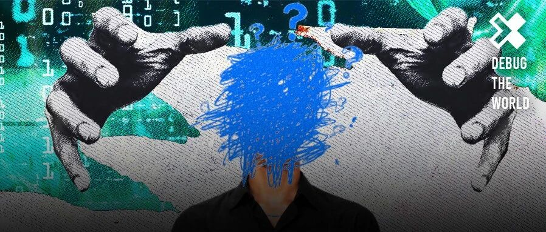
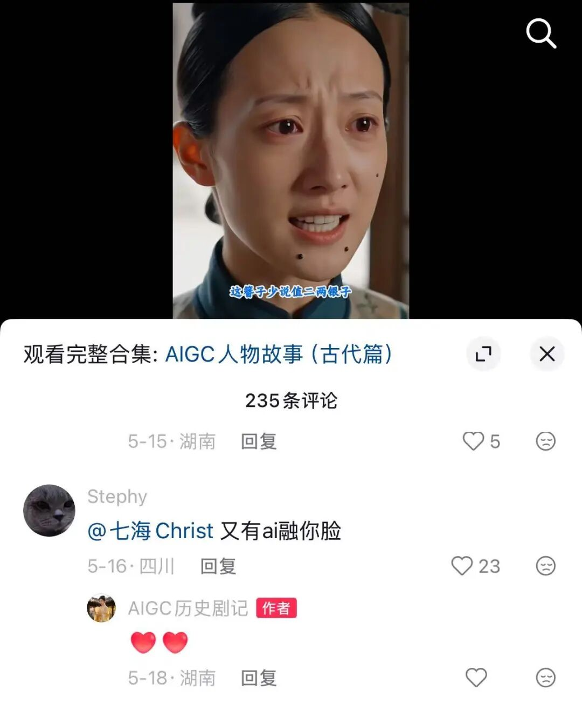
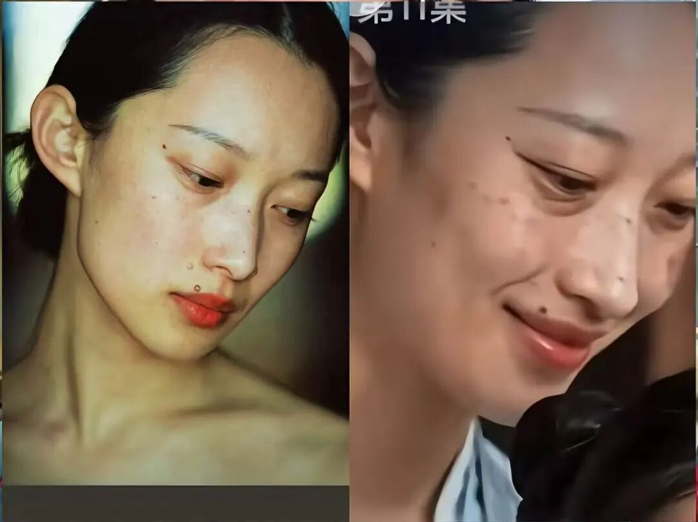
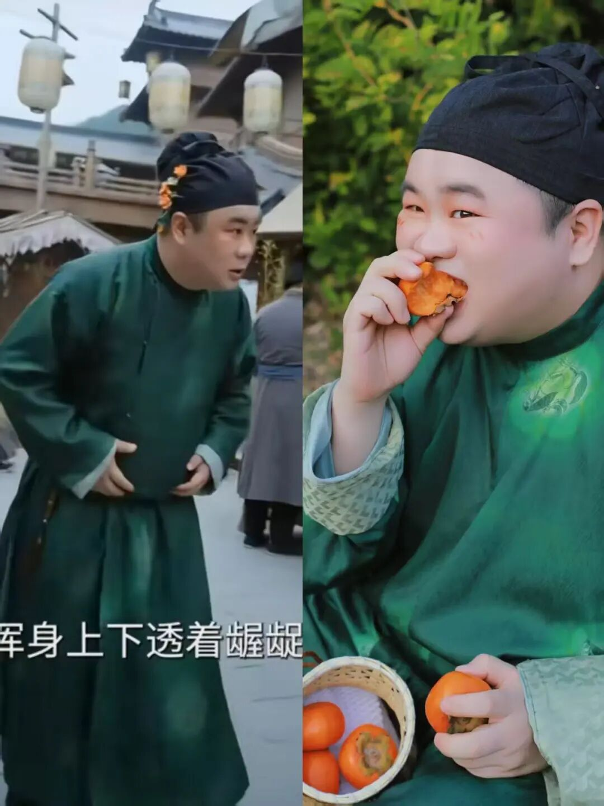
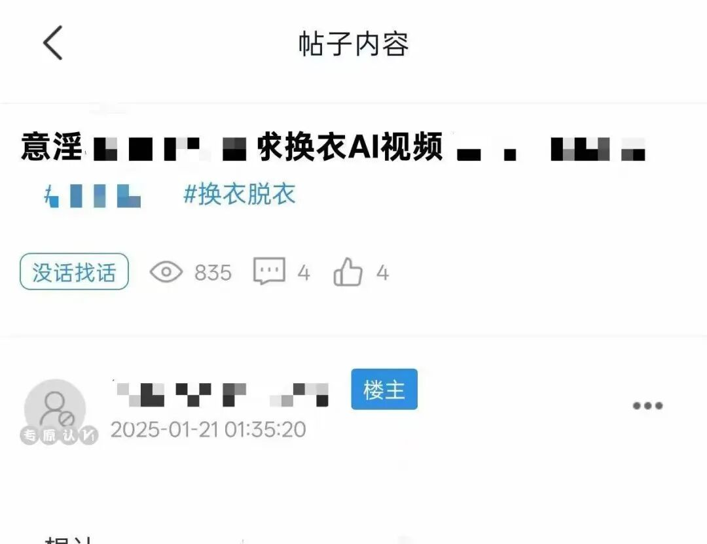
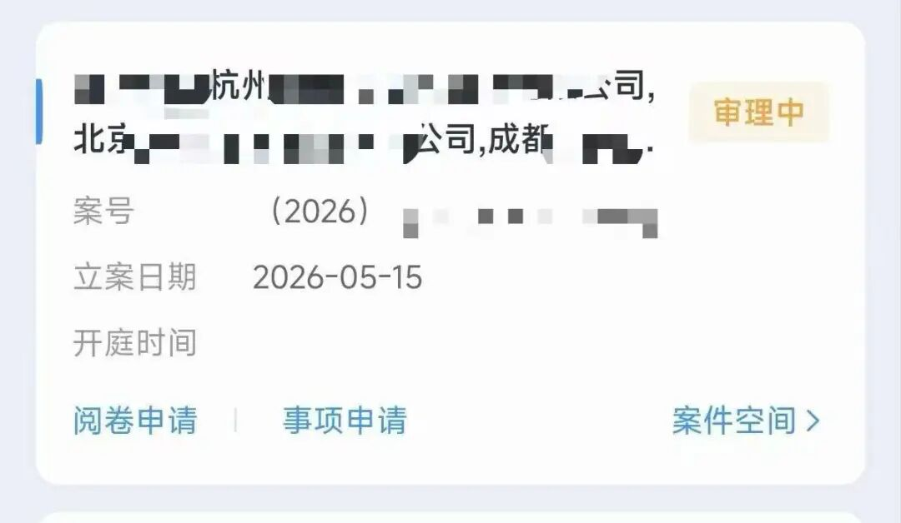

# 我找到4位被 AI “盗脸”的人，他们是如何抵抗的？

> Source: wechat
> Author: 差评X.PIN
> Original: https://mp.weixin.qq.com/s/WA1ZKFMky0ixUbGcPErMMA

---

---

\* 本文原创发布于差评孵化的商业财经类帐号 “ 知危 ”

普通人发布在社交媒体上的照片，可能在毫不知情中被人喂给 AI 模型，换脸成为 AI 短剧中的反派、丑角。受害者包括模特、汉服妆造师、博主。

而在更隐秘的角落，AI 技术也被部分人所利用，瞄准身边女性，生成虚假色情视频，捏造黄谣，引发人肉开盒，一名受害者发现，有成人网站已经将其打造成了盈利产业链。

**4 位被 AI 盗脸的普通人、律师、AIGC 从业者，向知危讲述了他们亲历的 AI 盗脸及产生的代价。**

**当 AI 能把任何人的脸变成商品、泼脏水的工具的时代，普通人是否还拥有自己脸的主权？**

短剧《 桃花簪 》盗脸风波的当事博主七海告诉知危，这部剧下架后，她本以为事情可以告一段落。但她未想到，这仅仅是个开始。

越来越多网友艾特提醒她：**她的脸，或者说 “ 疑似她的脸 ”，正在更多短剧里出现**。而角色的五官比例、面部的痣，都与她高度相似。

她去平台上求证，点开一部屏幕底部标着 AI 生成标识的短剧，剧中的女性形象形似但又非完全复刻她的脸，嘴唇上方、脸颊挂着黑痣，性格暴躁，虚荣爱撒谎。七海觉得，**自己的脸似乎被某种技术悄悄 “ 融 ” 进了批量生产的剧本里，成了一个符号化的丑角**。

七海不断收到疑似被融脸的提醒

第一次在屏幕看到自己的 “ 赛博分身 ”，是 3 月 30 日晚。网友提醒她，《 桃花簪 》短剧盗用甚至丑化自己的脸时，她起初很好奇。她点开短剧平台，看到《 桃花簪 》短剧中 AI 生成的自己的脸，眼神不自然、步态奇怪，七海感到强烈的恐怖谷效应，短剧里自己的脸也变得陌生可怖。

《 桃花簪 》11 集，“ 何掌柜 ” 仇视和辱骂女性、虐待动物；13 集，“ 何掌柜 ” 和主角发生冲突，被暴力掌掴、撕扯头发。看到这些，七海出离愤怒。**她发现，这位 “ 何掌柜 ” 与她相似的脸，出自自己 2024 年发布的一组高清肖像照，主题是 “ 痣是美貌的点缀 ”。**

七海制作的个人写真与《桃花簪》中何掌柜的对比图

七海 26 岁，来自云南小城，大学时代开始兼职模特的她，一步一步奋斗至小有名气，她曾参与上海电影节宣传片、《 Vogue 》等杂志商业项目……作为博主，七海也在社媒上分享自己的日常。

当晚，**七海在维权视频中称，《 桃花簪 》短剧盗脸、丑化是对她的职业污染，也是对她人品的精准侮辱**。

她在抖音发布的维权视频播放量目前已破千万，此后每隔几天，七海就会收到私信提醒，说 AI 短剧中，仍有酷似她的脸在不断地出现；某电商公司的员工私信她，他们公司用 AI 生成广告时，也使用了她的脸……

被《桃花簪》偷脸的另一位，是剧中 “ 何掌柜 ” 的丈夫 “ 刘大 ”，该角色盗脸了一位素人化妆师白菜 （ 化名 ） 在社媒上仅有几十点赞的肖像照。

白菜从事汉服妆造工作，3 月 30 日晚，朋友突然问他 “ 去拍短剧了吗？” 白菜感到 “ 莫名其妙 ”，直到看到《 桃花簪 》里男配角 “ 刘大 ” 的面容、身穿墨绿色汉服、鬓角的簪花，复刻了自己去年上传在小红书上的汉服写真。**这是姐姐给他拍摄的寓意 “ 柿柿如意 ” 的汉服写真，而短剧里的角色则是贪财好色的丑角**：猫着腰，眼睛流连忘返地看着美女，还被旁白形容为 “ 龌龊 ”、“ 人厌狗嫌 ”。

左为 AI 短剧《 桃花簪 》中的 “ 刘大 ”，右为 2025 年 1 月白菜在小红书发布的写真  ｜ 受访者供图

在当时，AI 短剧如何盗用普通人面容，完全是一个技术黑箱。4 月 3 日，红果短剧发布公告，在 72 小时审核期内，出品方未能提供 “ 足以证实合规使用素材的证据 ”，**《 桃花簪 》最终被判定违规下架，该出品方所有短剧被暂停上传 15 天**。

处在风口浪尖中的《桃花簪》制作团队，始终保持沉默。桃花簪的制作链条涉及多个主体，短视频平台上的发布账号关联为 “ 成都微麻微辣文化传播有限公司 ”，制作机构登记为杭州映趣短剧阁科技有限公司 （ 现更名为 “ 杭州映趣拾光科技有限公司 ”），其播出平台为红果短剧。

AI 短剧从业者康奈 （ 化名 ） 告诉知危，《 桃花簪 》剧组盗脸真人事件发生时的 3 月份，“ **AI 短剧中的演员，多是以真人为基础进行二创**。短剧制作方会为每个角色建模，包括细节脸部、发型、妆造、身材、穿搭等方面。因为如果不是统一进行基础建模，视频大模型生成时，可能会自由发挥，很容易与原角色不一致。**如果二创不彻底，就会被本尊认出。**《 桃花簪 》是被人盯着看，才认出的。”

康奈补充，《 桃花簪 》这样的工作流已经被迭代了，**现在 AI 短剧的主角基本上都基于视频大模型生成的标准脸，标准脸不会撞脸明星。但大模型中的无版权脸样本不多，导致如今短剧中的人脸看起来千篇一律**。

康奈还告诉知危，红果短剧至少需要在短剧上架后的一个月或者两个月才能到达第一个结算周期。如果这个窗口期出现几次投诉，只要红果认定侵权成立，短剧制作方就拿不到收益。“ 单单是算力成本、短剧操作员抽卡师等成本加在一起，AI 短剧每分钟的真实成本大约在 700 元左右 ”。

《 桃花簪 》是一部典型的 AI 仿真人短剧，这部标签为 “ 剧情、逆袭、古风 ”，共 72 集，每集不到 2 分钟。照上述成本评估，这部短剧约莫要亏损 10 万元。

AI 短剧盗脸，无疑是一个双输的结果。

AIGC 短片导演连飞 （ 化名 ） 则认为，这种精准地盗脸普通人，主要是人为的，跟模型没有关系。

**目前，国内主流的 AI 视频模型即梦 AI、可灵 AI、小云雀 AI 等平台对于真人肖像权有审核**。“ 这些模型都有自己的 IP 版权库 ，有版权保护的人物形象不可能不报备就生成。例如我想要某个艺术家的脸出片，普通账号、即梦开白账号， 都生成不了他的脸。要写授权书、签字、走流程才行。今年 3 月起，平台无法不经授权上传普通人的照片，只能上传 AI 生成的、有 AI 钢印的人物照片。但有用户会设法绕过平台的审查，绕过审查的方法包括使用用黑白线稿转实拍、多视图等。”

他进一步说明 AI 短剧公司盗用普通人脸的逻辑：“ AI 视频模型底层设定的是绝不会跟普通人撞脸的标准脸，如果光靠写提示词在 AI 模型里生成角色，出来的差不多都是同样的脸。**但为了让 AI 短剧的配角有识别度，在做不了名人的情况下，就会去小红书等社交媒体上偷普通人的照片**。”

连飞还指出，“ **一些 AI 短剧公司，会避开主流 AI 模型，使用自己的 LoRA 模型**，或者通过接入一些国外的模型 API 来制作，如谷歌模型或者 OpenAI 模型等训练出人物的脸，训练出人物的脸 ”。但成都微麻微辣文化传播有限公司、杭州映趣短剧阁科技有限公司均未对外披露其具体使用的技术工具和工作流，以上是基于行业通用技术栈的推断。

除了平台和制作方这些 “ 可被看见 ” 的侵权者，还有大量类型程度的侵权发生在更隐秘的角落。这些侵权来自于一些个体、OPC （ 一人创业公司 ），侵权内容更加细碎，没有公司实体、没有上架短剧、没有公开引流，而维权的结局，很大程度上取决于对方是否愿意道歉。

七海被盗脸后，她认识的一名模特告诉她，自己拍摄的一组舞蹈照片，出现在某 AIGC 导演的 AI 短片中，被 AI 复刻了服装、妆造，生成了女阎王、甚至骷髅的形象。她取证后私信对方要求删除、下架、道歉，对方照做——问题解决了。

但也恰恰说明：**个人侵权并非无解，但目前快速处理的解药来自对方的良知，而不是你的权利。**

白菜说，在被短剧盗脸前，他从没接触过 AI。他最担心的是，“ 父母出身东北农民家庭，他们五六十岁的人，对于这些很不了解。如果用了我普通、没有化妆的照片生成图片威胁我的父母，或者进行电子诈骗，我根本无能为力。”

AI 盗脸频频发生背后，除了平台侵权、AIGC 从业者侵权，还包括来自暗网或者灰色产业链的侵权。

AI 短剧制作方利用 AI 视频大模型，公然盗脸普通人并在公域播放引流、变现。但还有一部分人通过 AI 将女性面孔嫁接到淫秽影像中，或者直接用 AI 生成黄色影像，施害者多为熟人、前任或隐匿于暗网的窥视者，意图羞辱、控制受害者或是盈利。

这些受害者，包括但不限于带货主播、网红、普通学生。

来自浙江的大学生小朱 （ 化名 ） 偶尔会在朋友圈分享日常。2026 年 3 月，小朱的抖音收到一条陌生网友私信：**你好，请问你是小朱吧，你的照片被上传到色情网站，我一直在找你。请相信我。**

小朱本以为是诈骗，直到她点开对方发的内容，看到自己。那些照片都是出自自己朋友圈的生活照片，配文是 “ 求 AI 一键换衣 ” 等。这名网友 3 年前就发现了这些照片，直到今年才通过识图，对应到小朱去年发布在小红书上的照片，找到并告诉了她。

小朱搜集到该男子在色情 App 上的发帖 ｜受访者供图

小朱震惊不已。她点开相关社区的 App 检索帖主的 ID 时，发现这些被 AI 合成的不雅影像被发布在某 App 后，会自动更新到另一个色情 App。她想要进一步搜集证据，发现该 App 有付费业务，她本人要充值后才能看到更多。

她拿着搜集到的不雅照去报警，却被告知：像 Telegram 这类跨境平台涉及跨境调查，他们没有调查权限，无法定位到具体嫌疑人，也无法立案。

**为揪出对方，小朱将自己推进一场真人版“ 狼人杀 ”。她的朋友付 200 元门槛费添加对方 qq，假装想要看到更多色情照片，催促对方发照片。而小朱通过给朋友圈中的男性分为 3 组，分组更新自己的动态，观察 App 上的盗图状况。**

小朱锁定几位后，挨个以 “ 仅对方可见 ” 的形式继续发图，半个月后，她明确了盗图者：**是 3 年前追求过她的一位邻校男生**。相处两个月后，男生干预她发朋友圈、交友，她觉得两人不合适，和平地中断了往来。此后两人再无交集，这位男性偶尔在朋友圈给她点赞，他也会在朋友圈晒出恋爱三年的女友。

固定男性在 App、付费论坛上的照片、以及自己仅对对方可见的朋友圈等证据，小朱报警立案。**据小朱所知，包括自己在内，这名男子盗图并进行 AI 造黄的有四位女性，都来自他的熟人圈，其中疑似有未成年人。**

警方突击这名男子的住所将他抓获后，他删除了不良网站上自己能够删除的所有内容。然而，**他账号违规发布的伪造的不雅影像，以及被上传到关联网站的影像，继续留存在赛博世界，删除至今无解。**

晓敏 （ 化名 ） 则在 19 岁那年，险些遭遇骚扰与开盒。2024 年 5 月，她的微信号似乎被泄露，涌入陌生人试图添加她为好友，好友申请内写有性暗示信息。

不久后，晓敏被提醒得知，有人在一个叫 “ XX XX 身边人 ” 的 Telegram 聊天群中发了她的肖像照，“ 这个群组显示有几千人。这些人在群里发布正常图片，一旦有人私聊，盗用我照片的人，就会私发 AI 换脸后生成的不雅照。”

晓敏确定，“ 我知道是 AI 换脸术，但并不知道是什么具体的工具，在 Telegram 这类群聊中有很多别人发布的网址，点击就能使用的。但是这些人只会在群里发布正常照片，然后等别人私信后，他会发布 AI 换脸后的照片以及视频 ”。

群组成员被鼓励发身边女性的照片，作为类似入群的 “ 投名状 ”。有看完照片的男性会去社交媒体上寻找受害者，私信发去伪造的影像，目的就是为控制、羞辱和报复。

**晓敏的一位同学潜入 Telegram 群组，收集了她被 AI 换脸的照片，最终确认盗取她照片的熟人，是 “ 我通过收到的图片和我朋友圈的图片对比，发现有单独的照片发给过某人，确定是他后再发布仅他可见的图片朋友圈，他继续发布在外网，证据链完整。和他是高中同学，日常交流，几乎没有负面交集。”**

2025 年 1 月，晓敏去报警，同小朱一样，被告知外网证据难以溯源、未定位到嫌疑人难以立案。晓敏最终花 300 元咨询律师询问取证流程，同样使用朋友圈分组分组法，录屏自己发布的朋友圈后、男生紧随在外网发布照片的证据。搜集证据过程中，晓敏反复看到照片，开始 “ 恶心想吐、心跳加速 ”。艰难花费了半个月，终于定位到嫌疑人，搜集完整的证据链，她终于收到行政案件立案告知书。

晓敏在考虑起诉，但咨询后得知，由于此类案件通常要达到传播淫秽色情制品牟利、给普通人造成现实生活影响程度，才能发起公诉。如果要走 “ 侮辱罪 ” 的自诉，意味着晓敏要继续付出律师费和时间，最终，晓敏选择要求男性道歉赔偿、删除所有账号内容，走和解的路。

而小朱自己在搜集证据过程中，在 2026 年春天，被确诊了轻度抑郁。如今小朱拒绝了男方提出的 1 万元和解费，她自费 1 万元律师费，坚决维权上诉，哪怕结果未知。

小朱和晓敏的遭遇揭示了 AI 造黄最隐秘的一层：**熟人作案。**

**当加害者是曾经的追求者、同学甚至 “ 最信任的朋友 ”，心理创伤就变成了 “ 我该相信谁 ” 的长久怀疑。**更无解的是法律与技术之间的裂缝：加害者用境外服务器和加密工具，连网警都难以跨境调证；技术平台掌握生成溯源信息，却极少向受害者开放。而被 AI 伪造淫秽视频的受害者如果要走 “ 侮辱罪 ”” 名誉权 ” 等自诉，往往要个体来承担相应的费用和时间成本。

像小朱、晓敏这类通过定位到嫌疑人，最终成功立案的，是 AI 造黄受害者中的少数。小朱在社交媒体上分享自己被 AI 造黄的过程后，有 4 位女性联系她并求助，她们也遭遇了类似的困境，但因难以定位到嫌疑人，所以难以立案、维权。

白菜目前的维权进度在立案阶段。白菜的代理律师、广东南方福瑞德律师事务所律师晏文龙说，七海和白菜在肖像权的可识别性相当清晰。但在名誉权层面，“ 需要明确像 AI 短剧这种情况是否构成名誉权侵权。”

“ 法律上认定名誉权侵权，要求行为足以导致被侵权人的社会评价降低。依托真人形象制作的短剧角色，如果短剧传播范围广泛，同时角色塑造带有丑化、侮辱性质，就能够直接推定被侵权人的社会评价因此降低，满足侵权要件，不需要被侵权人额外举证。”

七海希望 AI 短剧盗脸、侵权普通人的案件能够尽早开庭。七海以 “ 名誉权受损、人格侮辱和肖像权 ” 为由，发起起诉。**5 月 15 日，七海收到立案成功的消息，这也是第一起 “ AI 短剧盗脸普通人 ” 成功立案的案件。**

七海收到了立案通知 ｜受访者供图

整个 4 月，因取证、维权，她的生活作息被打乱，以往每月都有固定商务工作的她也没有接到合作邀约。**七海最初维权发声时，有人在微博评论她 “ 想要热度 ”。**

事实上，七海说，**“ 甲方不愿选择有争议的模特参与拍摄，即便我是受害者，他们也不会被选择我 ”。**

因为生活和成本压力，曾第一时间支持她维权的朋友考虑到她的职业生涯，建议她慎重考虑因维权带来的职业风险，七海焦虑不已。5 月，七海才慢慢恢复正常作息和生活。

七海告诉知危，“ 虽然按照现有法律，肖像权胜诉的概率很高，但是并不清楚对面的法务和律师会进行怎样的辩护。例如他们会使用技术巧合论应诉，说是 AI 数据无意抓取我的面部数据来消减事情的严重性，这是我比较担心的事情。”

2026 年 “ 短剧 AI 换脸迪丽热巴案 ” 的一审判决提到，被告短剧公司曾以 “ 技术巧合 ” 为由抗辩——声称侵权视频是 AI 自动生成的，被告并未刻意输入人物肖像，视频是算法随机生成的偶然结果，被告并无主观侵权恶意。但法院最终未采信这一证据。判决书显示：制作方虽提交了创作过程说明，却未能按法庭要求复现换脸过程。最终，两家短剧公司被认定侵犯迪丽热巴肖像权，须公开致歉并赔偿经济损失及合理费用。

七海忧虑难消。她担心的是似乎还有短剧仍在盗用自己的脸，但并不像《 桃花簪 》那样 1：1 复制。

“ 我去取证后，能起诉吗？”

北京市中闻律师事务所娱乐法律师刘凯告诉知危，**AI 环境下的肖像侵权正在不断升级，从过去简单地复制肖像，演变为算法凭空 “ 创造相似肖像 ”**。更有甚者，刻意保留当事人辨识度最高的特征，包括独有脸型、眼鼻形态、痣与酒窝等面部标记、习惯性神态、标志性发型，生成 “ 神似但不完全等同 ” 的虚拟形象。**刘凯认为，这本质上是钻规则漏洞，一边规避形式复刻，一边收割当事人自带的人气与辨识度价值。**

他进一步解释，**肖像侵权的判定不单纯看主观上是否故意盗脸，核心客观标准是形象能否被公众识别并对应到特定个人**。依据《 民法典 》肖像权保护规则，只要普通大众或目标受众能从虚拟形象中认出、联想到某一确定自然人，就属于对他人肖像权益的商业利用。

但被盗脸者仍面临现实困境，他总结为四大难点，“ 察觉发现难，很多人根本不知道自己人脸影像被拿去训练 AI、制作短剧；固定取证难，AI 生成的原始日志、后台数据全部掌握在制作运营方手中；源头溯源难，不少内容依托境外 AI 模型、海外平台发布，或是多层外包代工，主体追查繁琐；投入产出失衡，维权的时间、金钱成本常常高于最终判决的赔偿金额。”

刘凯给出的解法是：“ 长远来看，要落地完善 AI 内容强制标识、全链路溯源机制，压实平台事前审核、事后处置责任，压缩灰色侵权空间。明确任何人面部形象绝不允许被无偿当作 AI 训练、商业变现的素材。”

其实，在当前的环境下，AI 像一列绝不能减速的列车，很多普通人虽然没在车上，也没到被列车碾压的境地，**但他们莫名其妙地成为了 AI 维持速度的燃料**。

**在技术面前，很多事情是普通人无法预见的**，你不知道自己发在某个平台上的照片什么时候会以合法或非法的方式被拿去训练，就像最近《 宝可梦 GO 》玩家们突然发现他们游玩过程中产生的 300 亿张实景图，要被合法卖给军工企业做军用无人机的训练素材一样，这很离谱，但真实发生。

而我们要做的，就是**千万不要默默接受**。

正如白菜告诉知危：**“ 我要维权到底，让对方知道，侵权一个普通人，也有代价。”**

---

撰文：句芒

编辑：Rick、大饼

设计：子曰

如果您觉得本文还不错

欢迎关注差评孵化的商业财经类账号：知危（ ID:BusinessAlert ）

